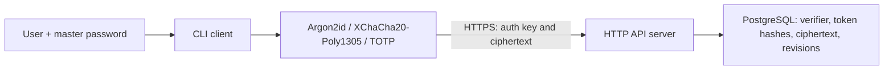

# Архитектура GophKeeper

## Границы Системы

Клиент отвечает за мастер-пароль, вывод ключей, шифрование, расшифрование и
отображение секретов. Сервер отвечает за регистрацию, bearer-сессии,
изоляцию владельцев и синхронизацию opaque encrypted envelopes.



Сервер не имеет ключа для раскрытия содержимого записи. Это упрощает доверенную
часть приложения: `vault.Service` работает только с ciphertext.

## Ключи

При регистрации:

```text
rootKey  = Argon2id(masterPassword, randomSalt, recordedParameters)
authKey  = HMAC-SHA256(rootKey, "gophkeeper/auth/v1")
wrapKey  = HMAC-SHA256(rootKey, "gophkeeper/vault-wrap/v1")
vaultKey = random(32 bytes)
wrappedVaultKey = XChaCha20-Poly1305(wrapKey, vaultKey, aad=username)
```

Сервер сохраняет `HMAC-SHA256(serverPepper, authKey)`, salt, параметры KDF и
`wrappedVaultKey`. После входа клиент локально извлекает `vaultKey`; записи
шифруются через него с `aad=itemID`.

## Синхронизация

У пользователя есть монотонный `current_revision`. Каждая успешная запись или
удаление получает новую revision. Запрос `GET /v1/sync?after=N` возвращает
текущие состояния записей, изменившихся после `N`, и новый cursor.

Изменение принимает `base_version`:

- новый объект отправляется с `base_version=0`;
- обновление и удаление используют текущую `version`;
- при устаревшей версии сервер отвечает `409 Conflict`;
- удаление сохраняется как tombstone, очищающий ciphertext.

Слияние plaintext на сервере невозможно и намеренно не выполняется.

## Пакеты

```text
internal/client/crypto     plaintext secret model and encryption
internal/client/otp        TOTP calculation and URI parser
internal/client/api        HTTPS JSON adapter
internal/client/session    protected local token profile
internal/client/command    CLI use cases
internal/server/auth       account and session logic
internal/server/vault      encrypted CRUD/sync logic
internal/server/httpapi    versioned transport adapter
internal/server/store      repositories
```

Интерфейс введён только для серверного repository: это даёт быстрые
интеграционные тесты через memory store и production persistence через
PostgreSQL без дополнительных абстрактных слоёв.

## Ограничения V1

- локального офлайн-кэша нет: `list/get` получают данные с сервера;
- клиент хранит bearer-токены в защищённом правами ОС файле, а не в keychain;
- сервер может удалить или откатить зашифрованные данные, хотя не может их
  прочитать;
- `edit` CLI обновляет имя и метаинформацию; замену payload можно выполнить
  новой записью с удалением старой.

